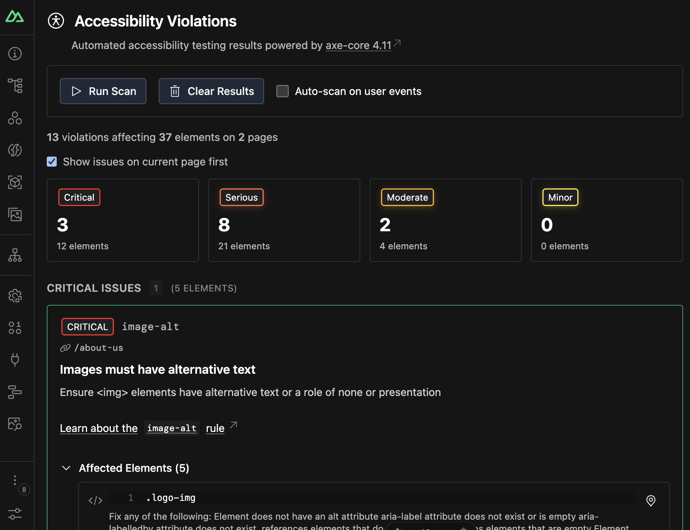
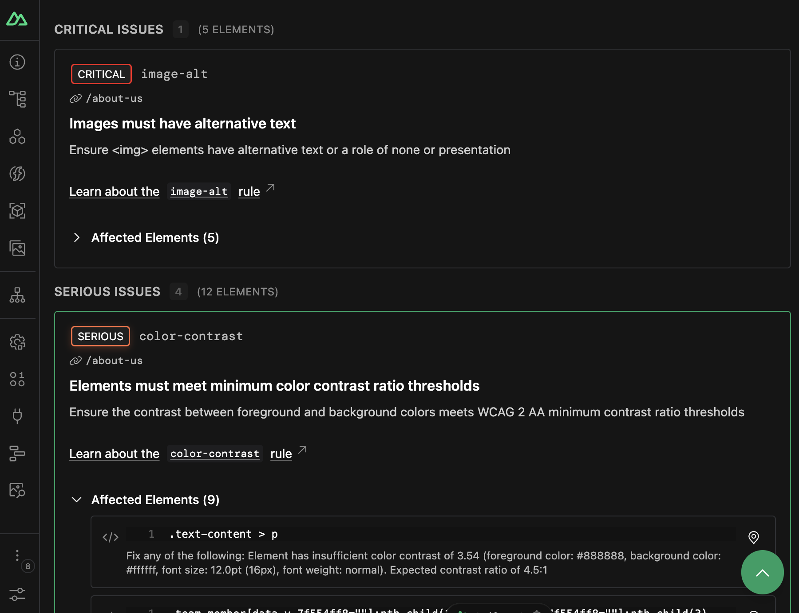
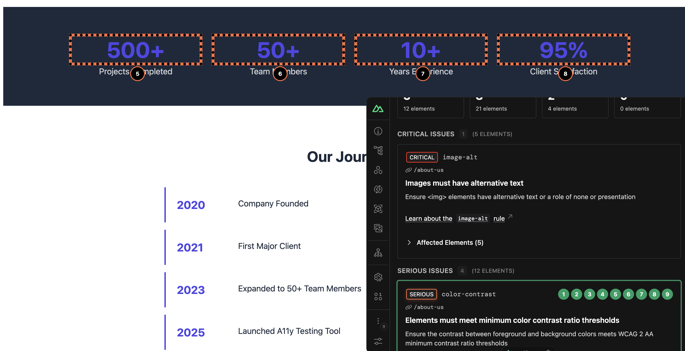

# Nuxt Accessibility

[![npm version][npm-version-src]][npm-version-href]
[![npm downloads][npm-downloads-src]][npm-downloads-href]
[![License][license-src]][license-href]
[![Nuxt][nuxt-src]][nuxt-href]

A Nuxt module that provides real-time accessibility feedback and automated testing right in your browser during development.

Nuxt Accessibility integrates directly into the Nuxt DevTools, giving you actionable insights to fix WCAG violations, improve accessibility compliance, and ensure your application is usable by everyone without ever leaving your development environment.

<!-- - [🏀 Online playground](https://stackblitz.com/github/nuxt/a11y?file=playground%2Fapp.vue) -->

## Getting Started

To install and add the module, you can run the following command:

```bash
npx nuxt module add a11y
```

The module is now automatically installed and added to your `nuxt.config.ts`. Now you can open your Nuxt app, go to the DevTools, and click the **Nuxt a11y** icon to get started.

## Features

- 🔍 **Rich DevTools UI**: A tab in Nuxt DevTools to visualize accessibility violations, inspect elements, and get recommendations.
- ⚡️ **Powered by axe-core**: Industry-leading accessibility testing engine used by Google, Microsoft, and thousands of developers worldwide.
- 🎨 **Element Highlighting**: Click any violation to highlight and pin affected elements on your page with numbered badges.
- 🎯 **Impact-Based Organization**: Violations categorized by severity (critical, serious, moderate, minor) to help you prioritize fixes.
- 🔄 **Results based on Routes**: Automatically tracks violations across all routes as you navigate your application.
- ⚙️ **Auto-Scan - Constant Scanning Mode**: Automatically scans for accessibility issues every time you interact with the app.
- 🎛️ **Configurable Options**: Auto-highlight all violations, customize axe-core settings, and control console logging.

## Visual Interface within DevTools

Nuxt Accessibility provides a rich, interactive UI inside the Nuxt DevTools panel.

### Dashboard Overview



A central hub showing:
- Total violations and affected elements across your application
- Violations grouped by impact level (critical, serious, moderate, minor)
- Quick stats for violations per page
- Control panel for manual scans, auto-scanning, and clearing results

### Violation Cards



Each violation displays:
- **Impact badge** with color-coded severity
- **Rule ID and description** from WCAG/axe-core
- **Learn more link** to detailed documentation
- **Affected elements count** with expandable details
- **Interactive element badges** to pin/unpin specific elements
- **CSS selectors** for each affected element
- **Scroll-to-element** button for quick navigation

### Highlighting



- **Click violation cards** to highlight all affected elements on your page
- **Numbered badges** appear on highlighted elements for easy identification
- **Click individual elements** to toggle highlighting for specific nodes
- **Scroll to element** button jumps to the element's location on the page
- **Route-aware highlighting** shows which violations belong to the current page

## How It Works

### Automated Accessibility Testing

Nuxt a11y uses **axe-core** to perform comprehensive accessibility audits. The module automatically:
1. Runs accessibility scans when you navigate to a new page
2. Detects violations against WCAG 2.0, WCAG 2.1, WCAG 2.2, and best practices
3. Groups violations by impact level and tracks them across routes
4. Provides detailed information about each violation including CSS selectors, failure summaries, and remediation guidance

### Element Highlighting

The module hooks into your application to provide interactive debugging:
- **Click-to-pin**: Click any violation to pin and highlight affected elements with numbered badges
- **Hover positioning**: Badges dynamically follow elements as you scroll
- **Route tracking**: Violations are associated with specific routes for better organization
- **Smart root element handling**: Prevents highlighting of `<html>` and `<body>` tags with helpful notifications

### Auto-Scan -  Constant Scanning Mode

Enable optional real-time scanning that listens to user interactions:
- Monitors mouse, keyboard, and touch events
- Debounced scanning to prevent performance issues
- Automatically detects new violations as DOM changes occur
- Can be toggled on/off from the DevTools control panel

## Configuration

### Module Options

```typescript
export default defineNuxtConfig({
  modules: ['@nuxt/a11y'],
  
  a11y: {
    // Enable/disable the module (default: true in dev mode)
    enabled: true,
    
    // Auto-highlight all violations when detected
    defaultHighlight: false,
    
    // Log violations to browser console
    logIssues: true,
    
    // Configure axe-core
    axe: {
      // axe-core configuration options
      options: {},
      
      // axe-core run options
      runOptions: {},
    },
  },
})
```

### Configuration Options

#### `enabled`

- Type: `boolean`
- Default: `true` (in development mode only)

Enable or disable the accessibility module. By default, the module only runs in development mode.

#### `defaultHighlight`

- Type: `boolean`
- Default: `false`

Automatically highlight all accessibility violations when they are detected. When enabled, all violations on the current page will be pinned and highlighted with numbered badges.

```typescript
a11y: {
  defaultHighlight: true, // Auto-highlight all violations
}
```

#### `logIssues`

- Type: `boolean`
- Default: `true`

Controls whether accessibility violations are logged to the browser console. When enabled, violations will be logged with appropriate styling and severity levels.

```typescript
a11y: {
  logIssues: false, // Disable console logging
}
```

#### `axe.options` & `axe.runOptions`

- Type: `object`
- Default: `{}`

Configure the underlying [axe-core](https://github.com/dequelabs/axe-core) runner. See the [axe-core documentation](https://github.com/dequelabs/axe-core/blob/develop/doc/API.md#options-parameter) for available options.

```typescript
a11y: {
  axe: {
    options: {
      // Customize which rules to run
      rules: {
        'color-contrast': { enabled: true },
      },
    },
    runOptions: {
      // Customize how axe-core runs
      runOnly: ['wcag2a', 'wcag2aa'],
    },
  },
}
```

## Development

```bash
# Install dependencies
pnpm install

# Generate type stubs
pnpm dev:prepare

# Develop with the playground
pnpm dev

# Build the playground
pnpm dev:build

# Run ESLint
pnpm lint

# Run Vitest
pnpm test
pnpm test:watch

# Release new version
pnpm release
```

<!-- Badges -->
[npm-version-src]: https://img.shields.io/npm/v/@nuxt/a11y/latest.svg?style=flat&colorA=18181B&colorB=28CF8D
[npm-version-href]: https://npmjs.com/package/@nuxt/a11y

[npm-downloads-src]: https://img.shields.io/npm/dm/@nuxt/a11y.svg?style=flat&colorA=18181B&colorB=28CF8D
[npm-downloads-href]: https://npmjs.com/package/@nuxt/a11y

[license-src]: https://img.shields.io/npm/l/@nuxt/a11y.svg?style=flat&colorA=18181B&colorB=28CF8D
[license-href]: https://npmjs.com/package/@nuxt/a11y

[nuxt-src]: https://img.shields.io/badge/Nuxt-18181B?logo=nuxt.js
[nuxt-href]: https://nuxt.com
